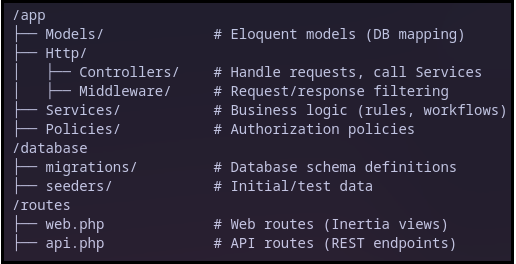
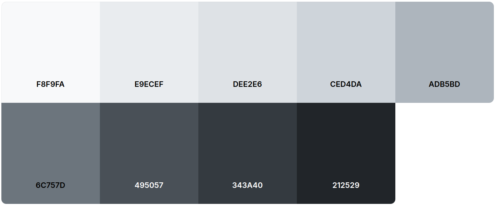

# 📘 AREA Project – Style Guide

This **style guide** defines the conventions and best practices for the AREA project.
It ensures consistency, clarity, and scalability across the **Laravel backend**, **React frontend**, **PostgreSQL database**, and **Inertia.js bridge**.

---

## 1. 🎯 Introduction
- **Purpose**: Maintain a consistent coding and design style across backend, frontend, and documentation.
- **Scope**: Applies to Laravel, React, PostgreSQL, Inertia, Docker, and documentation.
- **Principles**: Clarity, maintainability, reusability, accessibility, and security.

---

## 2. 🖥️ Code Conventions

### 2.1 Languages & Frameworks
- Backend: **Laravel (PHP 8+)**
- Frontend: **React (TypeScript preferred)**
- Bridge: **Inertia.js**
- Admin Panel: **Filament 3.x ⚡**
- Database: **PostgreSQL**
- Styling: **TailwindCSS**
- Build Tool: **Vite**
- Package Managers: **Composer (PHP) + npm (Node.js)**

### 2.2 Naming
- Files & Folders: `PascalCase` (e.g., `UserController.php`)
- Variables: `camelCase`
- Constants: `UPPER_CASE`
- Classes (PHP, React): `PascalCase`
- Database tables: `snake_case`, plural (e.g., `users`, `user_sessions`)
- Migrations: timestamped + descriptive
  - Example: `2025_09_21_123456_create_users_table.php`

### 2.3 Formatting
- PHP: Follow [PSR-12](https://www.php-fig.org/psr/psr-12/)
- JavaScript/TypeScript: Use ESLint + Prettier
- Indentation: 4 spaces (PHP), 2 spaces (JS/TS)
- Max line length: 100 chars

### 2.4 Error Handling & Logging
- Laravel: Centralized exception handling + logging via **Monolog**
- React: Error boundaries for UI errors
- PostgreSQL: Ensure **transactional integrity** (`BEGIN ... COMMIT/ROLLBACK`)

---

## 3. 🏗️ Architecture & Structure

### 3.1 Backend (Laravel)

- Use [Eloquent ORM](https://laravel.com/docs/5.0/eloquent) for database access.
- Follow [RESTful conventions](https://medium.com/@nadinCodeHat/rest-api-naming-conventions-and-best-practices-1c4e781eb6a5) for routes.

### 3.2 Frontend (React + Inertia)

- Components: `PascalCase.jsx/.tsx`
- Pages: Inertia views mapped to Laravel routes
- Layouts: Global wrappers like `AppLayout`
- Pages should **mirror backend route structure**
- Services: Keep all API calls centralized
- Hooks: Use for shared logic (auth, fetching, etc.)

---

### 3.3 API Conventions

- Prefix all endpoints with `/api/`
- ✅ Example: `http://api.example.com/store/items/{item-id}`

### 3.4 Authentication

- Use Laravel [Sanctum](https://laravel.com/docs/sanctum) for API authentication
- OAuth2 login (Google, Facebook, X) via [Socialite](https://laravel.com/docs/socialite)

---

## 4. 🗄️ Database (PostgreSQL)
- **Naming**: `snake_case`, plural for tables, singular for models
- Schema changes: via **migrations**
- Default/test data: via **seeders**
- Always index foreign keys & frequently queried fields

---

## 5. 🎨 Visual Design Guidelines

### 5.1 Color Palette

Chosen palette from [Coolors](https://coolors.co/palettes/trending):

Our palette :

| Role              | HEX       | Usage                           |
|-------------------|-----------|---------------------------------|
| **Light**         | `#F8F9FA` | Main backgrounds, cards         |
| **Light Gray**    | `#E9ECEF` | Secondary backgrounds           |
| **Border Light**  | `#DEE2E6` | Light borders, dividers         |
| **Border**        | `#CED4DA` | Input borders, separators       |
| **Muted**         | `#ADB5BD` | Muted text, placeholders        |
| **Secondary**     | `#6C757D` | Secondary text, icons           |
| **Dark Gray**     | `#495057` | Primary text, headings          |
| **Darker**        | `#343A40` | Headers, navigation             |
| **Dark**          | `#212529` | Main text, buttons              |

👉 Ensure **contrast ratio ≥ 4.5:1** for accessibility

### 5.2 Typography
- **Primary font**: **Inter** (fallback: sans-serif)
- **Font weights**: Regular (400), Medium (500), Semi-bold (600), Bold (700)

#### Font Sizes & Hierarchy
| Element    | Size   | Weight    | Line Height | Usage                        |
|------------|--------|-----------|-------------|------------------------------|
| **H1**     | 32px   | Semi-bold | 1.2         | Page titles, main headings   |
| **H2**     | 24px   | Semi-bold | 1.3         | Section headings             |
| **H3**     | 20px   | Medium    | 1.3         | Subsection headings          |
| **H4**     | 18px   | Medium    | 1.4         | Component titles             |
| **Body**   | 16px   | Regular   | 1.5         | Main content, paragraphs     |
| **Small**  | 14px   | Regular   | 1.4         | Secondary text, descriptions |
| **Caption**| 12px   | Regular   | 1.3         | Labels, captions, metadata   |

### 5.3 Spacing & Layout
- Use **8px spacing system** (multiples of 8)
- Cards: Rounded corners **8px**
- Buttons: Rounded **4px**, subtle shadow

### 5.4 Components
- **Buttons**
  - Primary → solid, primary color, white text
  - Secondary → outline, primary border
  - Disabled → grey, no hover
- **Inputs** → rounded 4px, primary border on focus
- **Cards** → `0 2px 4px rgba(0,0,0,0.1)` shadow

---

## 6. 🧪 Testing & QA
- Backend: [PHPUnit](https://laravel.com/docs/testing)
- Frontend: [Jest + React Testing Library](https://jestjs.io/docs/tutorial-react)
- Coverage target: **≥ 70%**
- All tests must pass before merging

---

## 7. 📑 Documentation
- `README.md` → Setup, usage, API reference
- `HOWTOCONTRIBUTE.md` → Workflow for adding services, actions, reactions
- `BENCHMARK.md` → Analysis of technology stack choices
- `STYLE_GUIDE.md` → Design + coding rules for team members
- **Diagrams** → Use [Mermaid](https://mermaid.js.org/) for class & sequence diagrams

---

## 8. 🤝 Git & Collaboration
- **Branching model**
  - `main` → Production
  - `develop` → Staging
  - `feature/*` → New features
- **Pull Requests**
  - Require at least **1 approval**
- **Issues**
  - Use labels: `bug`, `feature`, `enhancement`, `urgent`

---
